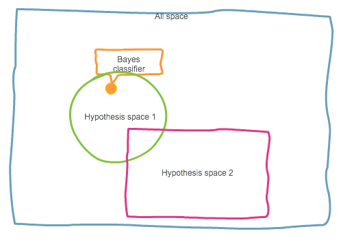

统计学习（Statistical learning）是目前人工智能领域最为活跃的一个分支，其理论基础是统计学习理论（Statistical learning theory，以下有时会简称SLT）：一种以数理统计为数学基础，研究是否可以以及如何从经验数据中学习普遍概念的理论。

目前诸多机器学习相关的初级书籍中，重点都放在了对各种模型的探讨，而对统计学习理论部分，要么是不涉及，要么是简要几页草草描述一下，这种不成体系的论述无法令读者尤其是机器学习的初学者对统计学习的基础理论形成系统化认知。

所以我阅读了一些SLT相关的论文，并对SLT的基础部分进行了一个系统化学习，这篇文章是我对SLT数理基础的整理和总结。

这篇文章目标是对于统计学习理论进行一个概述，在这个概述中，将始终保持简洁及易读，并尽量将SLT基础部分的系统脉络梳理清楚，给出SLT的一些基础但十分重要的结论。

虽然不希望数学公式成为各位阅读本文的障碍，但是想要完全抛弃数学语言，又可以明确阐述SLT是不可能的，因此文章中会不可避免存在一些相对严格的数学描述、公式及证明。读者只要具有本科工科的数学水平，即可以无障碍阅读此文。

<!-- toc -->

# 1 统计学习的定义及框架

## 1.1 目标

我们先来相对严格的描述，统计学习的目标是什么。

现设存在以下实体：

1. 集合$X$，称为输入空间，集合$Y$，称为输出空间
2. $X$与$Y$的联合概率分布$P(X,Y)$
3. $X$到$Y$的映射，$f(x)=y$，其中$x\in X, y\in Y$
4. 定义在$X$，$Y$及$f$上的函数$L(x,y,f)\rightarrow \mathbb{R}$，其中$\mathbb{R}$表示实数集合

统计学习的终极目标是**找一个映射$f$，使得$L$的期望最小**。所以，统计学习本质上是一个最优化问题，用数学语言描述，统计学习的目标找到下面的映射：
$$
f^\star=\mathop{\arg\min}_{f}{E(L(x,y,f))}
$$
## 1.2 最优解示例

注意假设我们知道$X$，$Y$，$P$和$L$的具体形式，那么统计学习则是根本不必要的，因为这本身变成了一个数学上的最优化问题，我们先忽略这个问题，并通过几个例子，建立对这个理论目标的直观认识。

> 例1：$L$为常数函数$L(x,y,f)=0$

根据期望的定义可知，此情况下$L$的期望$E(L(x,y,f))$亦退化为常函数恒等于0，因此问题变得十分trivial，只要随便取一个映射，如$f(x)=0$，即是目标映射

> 例2：$X=\mathbb{R}$，$Y=\mathbb{R}$，$L(x,y,f)=(y-f(x))^2$，且已知对于任意$x\in X$有$y=x^2$

此时，输入和输出之间的关系是完全确定的，不存在随机性。由$L$的定义可知$L\ge0$，因此只要取$f(x)=x^2$即可令$L$处处为0，因此期望也自然是0。此时$f(x)=x^2$就是最优解。

> 例3：$X=\mathbb{R}$，$Y=\mathbb{R}$，$L(x,y,f)=(y-f(x))^2$，且已知对于任意$x\in X$有$y=x^2+\epsilon$，其中$\epsilon\sim N(\mu,\sigma^2)$，即$\epsilon$服从均值为$\mu$，方差为$\sigma^2$的正态分布

这里和例2唯一的不同是，输出中多了一个随机变量。此时：
$$
E(L(x,y,f))=E((y-f(x))^2)
$$
取$f(x)=x^2+\mu$，则：
$$
\begin{align}
E(L(x,y,f)) &= E((x^2+\epsilon-x^2-\mu)^2) \\
&= E((\epsilon-\mu)^2) \\
&= E(\epsilon^2+\mu^2-2\mu\epsilon) \\
&= E(\epsilon^2)+E(\mu^2)-2E(\mu)E(\epsilon) \\
&= E^2(\epsilon)+Var(\epsilon) + \mu^2 - 2\mu^2 \\
&= \mu^2+\sigma^2+\mu^2-2\mu^2 \\
&= \sigma^2
\end{align}
$$
可以证明这是$E(L(x,y,f))$的最小值，所以$f(x)=x^2+\mu$是此时的最优解。

> 例4：$X=\{0,1\}$，$Y=\{0,1\}$，当$f(x)=y$，$L(x,y,f)=0$，否则$L(x,y,f)=1$，联合概率分布$P$取值如下：$P(X=0,Y=0)=0.1$，$P(X=0,Y=1)=0.3$，$P(X=1,Y=0)=0.4$，$P(X=1,Y=1)=0.2$

这是一个离散情况，我们现在不经证明给出起最优映射为$f(x)=1-x$，此时$L$的期望为：
$$
E(L(x,y,f))=0.1\times1+0.3\times0+0.4\times0+0.2\times1=0.3
$$

## 1.3 通用最优解

上面举了几个在各项条件已知的情况下，最优映射的例子，可以看到，随着$X$，$Y$，$L$，$P$的不同，最优解的形式也各不相同。那么我们自然会有一个疑问：是否存在一个通用最优解公式，对于任意的$X$，$Y$，$L$，$P$，均可以套用公式得到最优解？答案是存在。

但是直接在如此抽象的定义域上讨论通用最优解，会使得整个推理过于抽象，所以我们对定义域进行一定的限制，将重点放在以下两类常见的统计学习问题：

+ 回归问题（Regression）：$X=\mathbb{R}^m$，$Y=\mathbb{R}$，$L(x,y,f)=(y-f(x))^2$
+ 二分类问题（Binary Classification）：$X=\mathbb{R}^m$，$Y=\{0,1\}$，$L(x,y,f)=|y-f(x)|$

下面分别分析两类问题的最优解。

### 1.3.1 回归问题的最优解

在上述回归问题中，我们要求解的目标变成了：
$$
f^\star=\mathop{\arg\min}_f{E(L(x,y,f))}=\mathop{\arg\min}_f\int_Y\int_X(y-f(x))^2P(x,y)dxdy
$$
具体导出最优解的数学过程有点繁琐，所以这里我们用一个非严格但相对直观的方式，推导一下最优解。对严格数学推导过程感兴趣的同学可以自行推导，或参考资料。

首先，由上述公式可以看出，这里的期望值是一个大于等于0的值，且显然$(y-f(x))^2\ge0$。因此我们直观上能感受到，最优解$f^\star$应该使得$f^\star(x)$在任何地方都尽量接近$y$，这样才能让$(y-f(x))^2$尽可能小。

但是由于一般情况下我们认为$y$对$x$不是确定函数（否则这个函数就直接是最优解了），所以我们用条件概率刻画这个关系，任意给定一对$x\in X$，其对应的$y$服从：
$$
y\sim P(Y|X=x)
$$
而这个条件概率，可以对联合概率边缘化导出：
$$
P(Y|X=x)=P(x,Y)
$$
而要想令$(y-f(x))^2$尽可能小，直觉上我们可以让$f^\star(x)$取$X=x$是$y$的条件期望（实际上数学严格证明结论也是如此）：
$$
f^\star(x)=E_{Y|X}(Y|X=x)=\int_YyP(y|X=x)dy
$$
也就是说**回归问题的最优解是输入值的条件期望**。

### 1.3.2 二分类问题的最优解

二分类问题的最优解分析与回归问题类似，但是要简单很多，这得益于二分类问题的输出空间要更简单一些。下面具体看一下：

与分析回归类似，我们先代入已知条件，写出优化目标：
$$
f^\star=\mathop{\arg\min}_f{E(L(x,y,f))}=\mathop{\arg\min}_f\{|0-f(x)|P(X,0)+|1-f(x)|P(X,1)\}
$$
同时我们可以得到如下关系：
$$
P(X,0)=P(Y=0|X=x)P(X=x)
$$

$$
P(Y,0)=P(Y=1|X=x)P(X=x)
$$

由于$f(x)$只能输出0或1，可得：
$$
E(L(x,y,f)) =
  \begin{cases}
    P(Y=1|X=x)P(X=x),\text{when }\ f(x)=0\\
    P(Y=0|X=x)P(X=x),\text{when }\ f(x)=1
  \end{cases}
$$
若要最小化以上期望，等于在以上两者二选一，另外我们注意到$P(X=x)$是一个大于等于0的常数，所以我们只要在$P(Y=0|X=x)$与$P(Y=1|X=x)$选择较大的即可，即：
$$
f^\star(x)=\mathop{\arg\max}_y{P(Y=y|X=x)}
$$
**以上最优解叫做贝叶斯分类器，是二分类问题的理论最优分类器，也是平均意义下统计学习所能达到的分类器上限**。

## 1.4 统计学习

下面我们严格定义统计学习。为了简单起见，从现在起，我们所有的讨论都围绕二分类问题展开，所得到的各种结论，理论上都可以推广到一般化的问题，但是在这里就不再从一般意义上进行推导，而是默认将问题限定在二分类问题。

首先，我们给上面到处都用到的那个期望$E(L(x,y,f))$起一个名字：风险，用$R$表示。注意在其他条件已知的情形下，$R$是$f$的函数，即：
$$
R(f)=E(L(x,y,f))
$$
因此我们上述目标可以简化成：
$$
f^\star=\mathop{\arg\min}_{f}R(f)
$$
上文可以知道，如果我们知道联合概率分布$P(X,Y)$，则可以通过数学计算直接导出最优解：贝叶斯分类器。因此也就不需要统计学习什么的了，但是现实情况是，我们往往不知道，也无法通过什么方法观测到$P(X,Y)$，而只可以观测到一个可数但无穷（现实中往往是又穷的，但这里我们暂时放宽这个条件）的**独立无偏**样本：$D_n=\{(x_1,y_1),(x_2,y_2),...,(x_n,y_n)\},n\rightarrow\infty$，我们是否有某种可靠的方式，去得到或逼近贝叶斯分类器。

严格来说，（二分类）统计学习是这样一个问题：

------

已知输入空间$X=\mathbb{R}^m$，输出空间$Y=\{0,1\}$，损失函数$L(x,y,f)=|y-f(x)|$。另存在一固定但未知且不可直接观测联合概率分布$P(X,Y)$，以及可数但任意大的iid（独立同分布）抽样$D_n=\{(x_1,y_1),(x_2,y_2),...,(x_n,y_n)\},n\rightarrow\infty$。设$f_b$为$P$下的贝叶斯分类器。

现给出一个函数空间$F$（称为假设空间），和从$F$中选择分类器算法，使得当$n\rightarrow\infty$时，算法从$F$中选择的分类器的风险依概率收敛到贝叶斯分类器的风险，即对于任意$\epsilon>0$，由算法选择的$f\in F$满足：
$$
P(|R(f)-R(f_b)|>\epsilon)\rightarrow0,\text{when }n\rightarrow\infty
$$

------

注意，以上定义是一个非常严苛的定义，在此顶一下，我们要求我们的算法在样本无限多时能以任意大的概率和任意小的差距逼近最优分类器且对联合概率分布没有任何假设。这是我们最理想的统计学习，但实际中，由于达到这个目标非常困难，所以我们可能会退而求其次寻求一些更宽松的目标。

这一章节，我们通过数学方式严格定义了统计学习，并给出了最理想的情况。下一章节，我们进一步统计学习的一些细节问题。

# 2 一致性

## 2.1 对假设空间的思考

上面说道，我们的算法是从一个假设空间$F$中选择一个假设（函数），由此引出一个问题，不同的假设空间，对于是否能达到上述目标是有影响的。考虑下图中的两个假设空间：

其中All sapce是所有可能的分类器集合，橙色的分类器是贝叶斯分类器。可以看到，假设空间1包含了贝叶斯分类器，而假设空间2没有包含。那么，理论上任何算法都不可能从假设空间2中学到贝叶斯分类器（假设不存在与贝叶斯分类器的等效分类器），所以，如果我们不能保证所采用的假设空间包含贝叶斯分类器，就不可能达到上述的学习目标。

同时，由于我们对联合概率分布$P$一无所知，现实中很难有办法保证我们选择的假设空间一定包含$f_b$。

那么我们换个思路，能不能直接用All space作为假设空间。理论上是可以的，而且也确实有这种算法（例如KNN）。这样做虽然可以理论上直接以$f_b$为优化目标，但只有在样本真的是无限的情况下才可能，而且想要尽可能逼近$f_b$，对样本量的需求和对计算量的需求都会膨胀的十分迅速，因此实践中受现实条件所限，有可能无法使用。

## 2.2 偏差-方差均衡

另一类实践中更常用的方法是经验风险最小化（Empirical Risk Minimization，以下简称ERM），下面会有对ERM的单独讨论。这里只是简单说一下，ERM中存在偏差-方差均衡问题。为了解释这个，我们看下面的图：

橙色点是贝叶斯分类器$f_b$，绿色点是我们的假设空间中最优的分类器$f_F$，其数学定义为：
$$
f_F=\mathop{\arg\min}_{f\in F}(R(f_b)-R(f))
$$
灰色点是我们的学习算法在观察了$n$个样本后得到的分类器$f_n$，这里假设$f_b\notin F$。此时相较于最优分类器，我们的整体差距为：
$$
R(f_b)-R(f_n)=(R(f_n)-R(f_F))+(R(f_F)-R(f_b))
$$
其中前一部分叫做方差（Variance），含义是我们学到的分类器和假设空间中最优分类器的差距，后者叫做偏差（Bias），表示假设空间中最优分类器与贝叶斯分类器的差距。

我们当然希望两者可以同时被优化，但是后面的量化分析会提到，在ERM学习框架下，两者是矛盾的，为了缩小偏差，我们需要一个更大的假设空间，而更大的假设空间则意味着更大的偏差，甚至有可能导致ERM的学习过程不收敛（理论上不管多少样本也无法学到$f_F$），因此为了更小的方差，ERM希望有个一小的$F$，而这又往往意味着大的偏差。

总而言之，ERM框架下，一般来说实践中无法同时将方差和偏差无限优化，需要在两者间做一个权衡（样本无限时理论上偏差和方差可以同时收敛到0，但实践中往往不可能拥有无限样本）。

这里先简要给出这样一个结论，后面对ERM框架的定量分析会说明为什么会存在这个问题。

## 2.3 一致性

有了上述内容，现在我们可以定义一致性了，对一致性的严格描述是后续具体算法定量分析的基础。这里我们直接给出三种一致性的定义：

**一致（Consistent）**

在假设空间$F$和联合概率分布$P(X,Y)$固定的情况下，如果随着$n$趋向于无穷大，$f_n$依概率收敛于$f_F$，即对于任意$\epsilon>0$：
$$
P(R(f_n)-R(f_F)>\epsilon)\rightarrow 0,\text{when }n\rightarrow\infty
$$
则称学习算法一致。

**贝叶斯一致（Bayes-consistent）**

在假设空间$F$和联合概率分布$P(X,Y)$固定的情况下，如果随着$n$趋向于无穷大，$f_n$依概率收敛于$f_b$，即对于任意$\epsilon>0$：
$$
P(R(f_n)-R(f_b)>\epsilon)\rightarrow 0,\text{when }n\rightarrow\infty
$$
则称学习算法贝叶斯一致。

**全局一致（Universally consistent）**

在给定假设空间$F$的情况下，若不论联合概率分布$P(X,Y)$是什么分布，学习算法均贝叶斯一致，则称此算法全局一致。

可以看到，三种一致从上到下是越来越苛刻的，所以也越来越难达到。我们在1.4中给出的统计学习定义，是按照全局一致来定义的，这是最理想的情况。在实践中，很多时候并无法达到全局一致，所以实际中能达到贝叶斯一致甚至仅仅能做到一致的算法，也是十分有用的（同时也更加简单且节省资源）。

# 3 全局一致算法

我们首先来讨论一个已经在数学上被证明的全局一致的算法：K-nearest neighbor算法（简称KNN）。