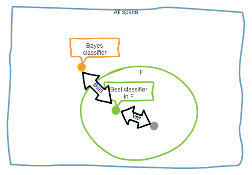
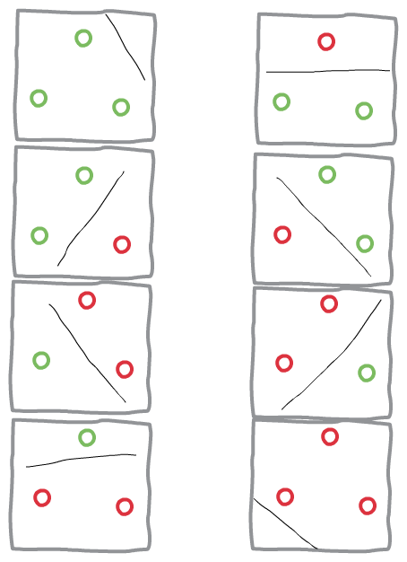
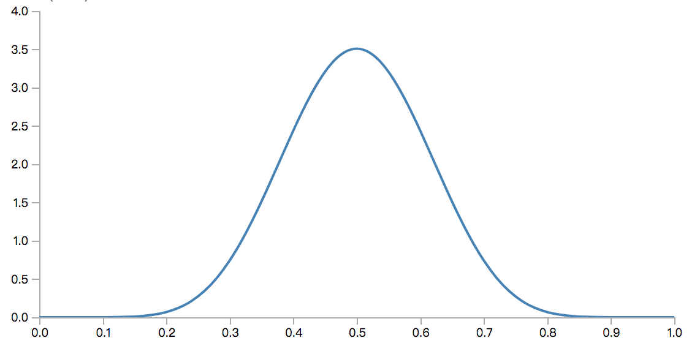

统计学习（Statistical learning）是目前人工智能领域最为活跃的一个分支，其理论基础是统计学习理论（Statistical learning theory，以下有时会简称SLT）：一种以数理统计为数学基础，研究是否可以以及如何从经验数据中学习普遍概念的理论。

目前诸多机器学习相关的初级书籍中，重点都放在了对各种模型的探讨，而对统计学习理论部分，要么是不涉及，要么是简要几页草草描述一下，这种不成体系的论述无法令读者尤其是机器学习的初学者对统计学习的基础理论形成系统化认知。

所以我阅读了一些SLT相关的论文，并对SLT的基础部分进行了一个系统化学习，这篇文章是我对SLT数理基础的整理和总结。

这篇文章目标是对于统计学习理论进行一个概述，在这个概述中，将始终保持简洁及易读，并尽量将SLT基础部分的系统脉络梳理清楚，给出SLT的一些基础但十分重要的结论。

虽然不希望数学公式成为各位阅读本文的障碍，但是想要完全抛弃数学语言，又可以明确阐述SLT是不可能的，因此文章中会不可避免存在一些相对严格的数学描述、公式及证明。读者只要具有本科工科的数学水平，即可以无障碍阅读此文。

<!-- toc -->

# 1 统计学习的定义及框架

## 1.1 目标

我们先来相对严格的描述，统计学习的目标是什么。

现设存在以下实体：

1. 集合$X$，称为输入空间，集合$Y$，称为输出空间
2. $X$与$Y$的联合概率分布$P(X,Y)$
3. $X$到$Y$的映射，$f(x)=y$，其中$x\in X, y\in Y$
4. 定义在$X$，$Y$及$f$上的函数$L(x,y,f)\rightarrow \mathbb{R}$，其中$\mathbb{R}$表示实数集合

统计学习的终极目标是**找一个映射$f$，使得$L$的期望最小**。所以，统计学习本质上是一个最优化问题，用数学语言描述，统计学习的目标找到下面的映射：
$$
f^\star=\mathop{\arg\min}_{f}{E(L(x,y,f))}
$$
## 1.2 最优解示例

注意假设我们知道$X$，$Y$，$P$和$L$的具体形式，那么统计学习则是根本不必要的，因为这本身变成了一个数学上的最优化问题，我们先忽略这个问题，并通过几个例子，建立对这个理论目标的直观认识。

> 例1：$L$为常数函数$L(x,y,f)=0$

根据期望的定义可知，此情况下$L$的期望$E(L(x,y,f))$亦退化为常函数恒等于0，因此问题变得十分trivial，只要随便取一个映射，如$f(x)=0$，即是目标映射

> 例2：$X=\mathbb{R}$，$Y=\mathbb{R}$，$L(x,y,f)=(y-f(x))^2$，且已知对于任意$x\in X$有$y=x^2$

此时，输入和输出之间的关系是完全确定的，不存在随机性。由$L$的定义可知$L\ge0$，因此只要取$f(x)=x^2$即可令$L$处处为0，因此期望也自然是0。此时$f(x)=x^2$就是最优解。

> 例3：$X=\mathbb{R}$，$Y=\mathbb{R}$，$L(x,y,f)=(y-f(x))^2$，且已知对于任意$x\in X$有$y=x^2+\epsilon$，其中$\epsilon\sim N(\mu,\sigma^2)$，即$\epsilon$服从均值为$\mu$，方差为$\sigma^2$的正态分布

这里和例2唯一的不同是，输出中多了一个随机变量。此时：
$$
E(L(x,y,f))=E((y-f(x))^2)
$$
取$f(x)=x^2+\mu$，则：
$$
\begin{align}
E(L(x,y,f)) &= E((x^2+\epsilon-x^2-\mu)^2) \\
&= E((\epsilon-\mu)^2) \\
&= E(\epsilon^2+\mu^2-2\mu\epsilon) \\
&= E(\epsilon^2)+E(\mu^2)-2E(\mu)E(\epsilon) \\
&= E^2(\epsilon)+Var(\epsilon) + \mu^2 - 2\mu^2 \\
&= \mu^2+\sigma^2+\mu^2-2\mu^2 \\
&= \sigma^2
\end{align}
$$
可以证明这是$E(L(x,y,f))$的最小值，所以$f(x)=x^2+\mu$是此时的最优解。

> 例4：$X=\{0,1\}$，$Y=\{0,1\}$，当$f(x)=y$，$L(x,y,f)=0$，否则$L(x,y,f)=1$，联合概率分布$P$取值如下：$P(X=0,Y=0)=0.1$，$P(X=0,Y=1)=0.3$，$P(X=1,Y=0)=0.4$，$P(X=1,Y=1)=0.2$

这是一个离散情况，我们现在不经证明给出起最优映射为$f(x)=1-x$，此时$L$的期望为：
$$
E(L(x,y,f))=0.1\times1+0.3\times0+0.4\times0+0.2\times1=0.3
$$

## 1.3 通用最优解

上面举了几个在各项条件已知的情况下，最优映射的例子，可以看到，随着$X$，$Y$，$L$，$P$的不同，最优解的形式也各不相同。那么我们自然会有一个疑问：是否存在一个通用最优解公式，对于任意的$X$，$Y$，$L$，$P$，均可以套用公式得到最优解？答案是存在。

但是直接在如此抽象的定义域上讨论通用最优解，会使得整个推理过于抽象，所以我们对定义域进行一定的限制，将重点放在以下两类常见的统计学习问题：

+ 回归问题（Regression）：$X=\mathbb{R}^m$，$Y=\mathbb{R}$，$L(x,y,f)=(y-f(x))^2$
+ 二分类问题（Binary Classification）：$X=\mathbb{R}^m$，$Y=\{0,1\}$，$L(x,y,f)=|y-f(x)|$

下面分别分析两类问题的最优解。

### 1.3.1 回归问题的最优解

在上述回归问题中，我们要求解的目标变成了：
$$
f^\star=\mathop{\arg\min}_f{E(L(x,y,f))}=\mathop{\arg\min}_f\int_Y\int_X(y-f(x))^2P(x,y)dxdy
$$
具体导出最优解的数学过程有点繁琐，所以这里我们用一个非严格但相对直观的方式，推导一下最优解。对严格数学推导过程感兴趣的同学可以自行推导，或参考资料。

首先，由上述公式可以看出，这里的期望值是一个大于等于0的值，且显然$(y-f(x))^2\ge0$。因此我们直观上能感受到，最优解$f^\star$应该使得$f^\star(x)$在任何地方都尽量接近$y$，这样才能让$(y-f(x))^2$尽可能小。

但是由于一般情况下我们认为$y$对$x$不是确定函数（否则这个函数就直接是最优解了），所以我们用条件概率刻画这个关系，任意给定一对$x\in X$，其对应的$y$服从：
$$
y\sim P(Y|X=x)
$$
而这个条件概率，可以对联合概率边缘化导出：
$$
P(Y|X=x)=\frac{P(x,Y)}{P(X=x)}
$$
而要想令$(y-f(x))^2$尽可能小，直觉上我们可以让$f^\star(x)$取$X=x$是$y$的条件期望（实际上数学严格证明结论也是如此）：
$$
f^\star(x)=E_{Y|X}(Y|X=x)=\int_YyP(y|X=x)dy
$$
也就是说**回归问题的最优解是输入值的条件期望**。

### 1.3.2 二分类问题的最优解

二分类问题的最优解分析与回归问题类似，但是要简单很多，这得益于二分类问题的输出空间要更简单一些。下面具体看一下：

与分析回归类似，我们先代入已知条件，写出优化目标：
$$
f^\star=\mathop{\arg\min}_f{E(L(x,y,f))}=\mathop{\arg\min}_f\{\int_X|0-f(x)|P(x,0)dx+\int_X|1-f(x)|P(x,1)dx\}
$$
上面的期望可以将联合概率分布改写为条件概率分布形式：
$$
E(L(x,y,f))=\int_X|0-f(x)|P(Y=0|x)P(x)dx+\int_X|1-f(x)|P(Y=1|x)P(x)dx
$$

同样我们来非严格的分析一下这个式子如何取最小值。注意这里$f(x)$可能的取值只有0和1，所以$|0-f(x)|$和$|1-f(x)|$的取值一定是一个0一个1，所以按直觉来说一个合理的推断是无论何时，我们希望让被积函数部分尽可能小，具体来说：

1. 如果$P(Y=0|x)P(x) > P(Y=1|x)P(x)$，我们希望$|0-f(x)|=0$且$|1-f(x)|=1$，即令$f(x)=0$
2. 如果$P(Y=0|x)P(x) < P(Y=1|x)P(x)$，我们希望$|0-f(x)|=1$且$|1-f(x)|=0$，即令$f(x)=1$

另外我们注意到$P(x)$是一个大于等于0的常数，所以我们只要在$P(Y=0|x)$与$P(Y=1|x)$选择较大的即可，即：
$$
f^\star(x)=\mathop{\arg\max}_y{P(Y=y|X=x)}
$$
**以上最优解叫做贝叶斯分类器，是二分类问题的理论最优分类器，也是平均意义下统计学习所能达到的分类器上限**。

## 1.4 统计学习

下面我们严格定义统计学习。为了简单起见，从现在起，我们所有的讨论都围绕二分类问题展开，所得到的各种结论，理论上都可以推广到一般化的问题，但是在这里就不再从一般意义上进行推导，而是默认将问题限定在二分类问题。

首先，我们给上面到处都用到的那个期望$E(L(x,y,f))$起一个名字：风险，用$R$表示。注意在其他条件已知的情形下，$R$是$f$的函数，即：
$$
R(f)=E(L(x,y,f))
$$
因此我们上述目标可以简化成：
$$
f^\star=\mathop{\arg\min}_{f}R(f)
$$
上文可以知道，如果我们知道联合概率分布$P(X,Y)$，则可以通过数学计算直接导出最优解：贝叶斯分类器。因此也就不需要统计学习什么的了，但是现实情况是，我们往往不知道，也无法通过什么方法观测到$P(X,Y)$，而只可以观测到一个可数但无穷（现实中往往是又穷的，但这里我们暂时放宽这个条件）的**独立无偏**样本：$D_n=\{(x_1,y_1),(x_2,y_2),...,(x_n,y_n)\},n\rightarrow\infty$，我们是否有某种可靠的方式，去得到或逼近贝叶斯分类器。

严格来说，（二分类）统计学习是这样一个问题：

------

**统计学习**

已知输入空间$X=\mathbb{R}^m$，输出空间$Y=\{0,1\}$，损失函数$L(x,y,f)=|y-f(x)|$。另存在一固定但未知且不可直接观测联合概率分布$P(X,Y)$，以及可数但任意大的iid（独立同分布）抽样$D_n=\{(x_1,y_1),(x_2,y_2),...,(x_n,y_n)\},n\rightarrow\infty$。设$f_b$为$P$下的贝叶斯分类器。

现给出一个函数空间$F$（称为假设空间），和从$F$中选择分类器算法，使得当$n\rightarrow\infty$时，算法从$F$中选择的分类器的风险依概率收敛到贝叶斯分类器的风险，即对于任意$\epsilon>0$，由算法选择的$f\in F$满足：
$$
P(|R(f)-R(f_b)|>\epsilon)\rightarrow0,\text{when }n\rightarrow\infty
$$

------

注意，以上定义是一个非常严苛的定义，在定义一下，我们要求我们的算法在样本无限多时能以任意大的概率和任意小的差距逼近最优分类器且对联合概率分布没有任何假设。这是我们最理想的统计学习，但实际中，由于达到这个目标非常困难，所以我们可能会退而求其次寻求一些更宽松的目标。

这一章节，我们通过数学方式严格定义了统计学习，并给出了最理想的情况。下一章节，我们进一步统计学习的一些细节问题。

# 2 一致性

## 2.1 对假设空间的思考

上面说道，我们的算法是从一个假设空间$F$中选择一个假设（函数），由此引出一个问题，不同的假设空间，对于是否能达到上述目标是有影响的。考虑下图中的两个假设空间：

其中All sapce是所有可能的分类器集合，橙色的分类器是贝叶斯分类器。可以看到，假设空间1包含了贝叶斯分类器，而假设空间2没有包含。那么，理论上任何算法都不可能从假设空间2中学到贝叶斯分类器（假设不存在与贝叶斯分类器的等效分类器），所以，如果我们不能保证所采用的假设空间包含贝叶斯分类器，就不可能达到上述的学习目标。

同时，由于我们对联合概率分布$P$一无所知，现实中很难有办法保证我们选择的假设空间一定包含$f_b$。

那么我们换个思路，能不能直接用All space作为假设空间。理论上是可以的，而且也确实有这种算法（例如KNN）。这样做虽然可以理论上直接以$f_b$为优化目标，但只有在样本真的是无限的情况下才可能，而且想要尽可能逼近$f_b$，对样本量的需求和对计算量的需求都会膨胀的十分迅速，因此实践中受现实条件所限，有可能无法使用。

## 2.2 偏差-方差均衡

另一类实践中更常用的方法是经验风险最小化（Empirical Risk Minimization，以下简称ERM），下面会有对ERM的单独讨论。这里只是简单说一下，ERM中存在偏差-方差均衡问题。为了解释这个，我们看下面的图：

橙色点是贝叶斯分类器$f_b$，绿色点是我们的假设空间中最优的分类器$f_F$，其数学定义为：
$$
f_F=\mathop{\arg\min}_{f\in F}(R(f_b)-R(f))
$$
灰色点是我们的学习算法在观察了$n$个样本后得到的分类器$f_n$，这里假设$f_b\notin F$。此时相较于最优分类器，我们的整体差距为：
$$
R(f_b)-R(f_n)=(R(f_n)-R(f_F))+(R(f_F)-R(f_b))
$$
其中前一部分叫做方差（Variance），含义是我们学到的分类器和假设空间中最优分类器的差距，后者叫做偏差（Bias），表示假设空间中最优分类器与贝叶斯分类器的差距。

我们当然希望两者可以同时被优化，但是后面的量化分析会提到，在ERM学习框架下，两者是矛盾的，为了缩小偏差，我们需要一个更大的假设空间，而更大的假设空间则意味着更大的偏差，甚至有可能导致ERM的学习过程不收敛（理论上不管多少样本也无法学到$f_F$），因此为了更小的方差，ERM希望有个一小的$F$，而这又往往意味着大的偏差。

总而言之，ERM框架下，一般来说实践中无法同时将方差和偏差无限优化，需要在两者间做一个权衡（样本无限时理论上偏差和方差可以同时收敛到0，但实践中往往不可能拥有无限样本）。

这里先简要给出这样一个结论，后面对ERM框架的定量分析会说明为什么会存在这个问题。

## 2.3 一致性

有了上述内容，现在我们可以定义一致性了，对一致性的严格描述是后续具体算法定量分析的基础。这里我们直接给出三种一致性的定义：

**一致（Consistent）**

在假设空间$F$和联合概率分布$P(X,Y)$固定的情况下，如果随着$n$趋向于无穷大，$f_n$依概率收敛于$f_F$，即对于任意$\epsilon>0$：
$$
P(R(f_n)-R(f_F)>\epsilon)\rightarrow 0,\text{when }n\rightarrow\infty
$$
则称学习算法一致。

**贝叶斯一致（Bayes-consistent）**

在假设空间$F$和联合概率分布$P(X,Y)$固定的情况下，如果随着$n$趋向于无穷大，$f_n$依概率收敛于$f_b$，即对于任意$\epsilon>0$：
$$
P(R(f_n)-R(f_b)>\epsilon)\rightarrow 0,\text{when }n\rightarrow\infty
$$
则称学习算法贝叶斯一致。

**全局一致（Universally consistent）**

在给定假设空间$F$的情况下，若不论联合概率分布$P(X,Y)$是什么分布，学习算法均贝叶斯一致，则称此算法全局一致。

可以看到，三种一致从上到下是越来越苛刻的，所以也越来越难达到。我们在1.4中给出的统计学习定义，是按照全局一致来定义的，这是最理想的情况。在实践中，很多时候并无法达到全局一致，所以实际中能达到贝叶斯一致甚至仅仅能做到一致的算法，也是十分有用的（同时也更加简单且节省资源）。

# 3 全局一致算法

长期以来，人们并不知道是否存在全局一致的统计学习算法。直到1977年，有人从数学上证明了K-nearest neighbor（kNN）算法（服从某些条件时）是全局一致的。

我们现在来讨论kNN和其一致性问题。

## 3.1 K-nearest neighbor算法定义

对于二分类问题，kNN可以这样描述：

------

**K-nearest neighbor算法（用于二分类的）**

设$d$是定义在$X$空间上的距离函数，其满足如下条件：

+ 任一点到自己的距离为零，即$d(x,x)=0$
+ $d$的取值非负
+ 满足三角不等式，即：$d(x_1,x_2)\le d(x_1,x_3)+d(x_3,x_2)$

kNN这样做分类：

对于待分类点$x\in X$，取$D_n$中与$x$距离最小的k个点的类别$Y_k=\{y_1,y_2,...,y_k\}$，以$Y_k$的众数（mode）为$x$的取值。

****

用白话说，就是找到$x$最近的k个样本，看这k个样本多数是0还是1，然后用多数表决的方式，为$x$分类。

不难证明，kNN是在忽略联合分布的情况下，直接去逼近贝叶斯分类器的方法。那么这是否说明kNN一定是全局一致呢？

## 3.2 kNN的一致性

我们先考虑最简单k=1的情况。考虑下面的例子：

> 例5：设输入空间$X\sim Uni(0,1)$，即在0到1的区间服从均匀分布，$Y$是一个与$X$独立的随机变量，且取0的概率为0.1，取1的概率为0.9。使用1NN分类器进行分类，使用欧氏距离为距离函数，求贝叶斯分类器及1NN分类器的风险各是多少。

先来考虑贝叶斯风险，由于$Y$独立于$X$，且取值1的概率更大，因此贝叶斯分类器为$f_b(x)=1$，此时贝叶斯风险为：
$$
R(f_b)=1\times0.1+0\times0.9=0.1
$$
而使用1NN分类器时，不管样本多大，离$x$最近的样本也服从取0的概率为0.1，取1的概率为0.9，我们设离$x$最近的样本为$x_d$因此，1NN分类器的风险为：
$$
R(f_{1nn})=P(y=0)\times P(x_d=1)+P(y=1)\times P(x_d=0)=0.1\times 0.9 + 0.9\times 0.1=0.18
$$
这个风险与样本集的数量无关。因此，1NN分类器在此情况下，不一致。

使用同样的思路，我们可以证明，**对于任意的有限的k，kNN算法均不一致**。

至此我们得到了一个kNN必要条件：若要kNN分类器一致，一个必要条件是$k\rightarrow\infty$。

那么这个条件是否也是一个充分条件呢？并不是。Stone在1977年关于kNN全局一致证明的论文中，给出了如下充要条件：

**kNN算法全局一致，当且仅当，随着$n\rightarrow \infty$，$k\rightarrow \infty$，且$k/n\rightarrow 0$**

由此可以看成，kNN虽然是一个理论上全局一致的算法，但是实际中受限于训练样本的数量，其实很难做到适用于各种场景的万金油。否则，我们也不用研究其他算法，全都用kNN就好了。

同时可以从上面看到，如果想要kNN发挥较好的效果，除了样本量$n$要足够大外，$k$的选择也尤为重要，根据理论分析，较好的选择是$k\sim log(n)$。如果k过小，例如1NN，此时方差很大，模型很容易过拟合，但如果k特别大，例如极端情况，$k=n$，此时分类器对于所有新样本均预测为同样的值（样本集的多数），导致欠拟合。

# 4 经验风险最小化

从上面分析可以看出，kNN算法虽然理论上可以达到全局一致，但是受限于现实中样本数量，并不是处处通用。下面讨论另一种统计学习准则：经验风险最小化。

## 4.1 定义

所谓经验风险最小化（Empirical Risk Minimization，简称ERM），就是选择分类器$f_n$，使得分类结果在训练样本集上风险最小。为了形式化定义ERM，我们先定义经验风险：

设有样本集$D_n=\{(x_1,y_1),(x_2,y_2),...,(x_n,y_n)\}$，分类器$f$的经验风险定义为：
$$
R_{emp}(f)=\frac{1}{n}\sum_{i=1}^n{L(x_i,y_i,f)}
$$
经验风险最小化就是选择$f_n$，使得：
$$
f_n=\mathop{\arg\min}_{f\in F}R_{emp}(f)
$$
直觉上这是很合理的，如果训练样本来自总体的无偏独立抽样，那么感觉只要最小化经验风险，应该也可以得到一个总体风险很小的分类器。但这毕竟是直觉，下面我们从数学上严格的分析一下ERM是否能真的如我们所愿。

## 4.2 对ERM一致性的初步探讨

首先我们来考察ERM的一致性，这里我们先不要求全局一致或贝叶斯一致，只要求最宽松的一致性，即在样本无限多的情况下，ERM是否能无限逼近$F$中风险最小的分类器$f_F$。

考虑下面的例子：

> 例6：设输入空间$X\sim Uni(0,1)$，即在0到1的区间服从均匀分布，，其中当$X\le0.5$时，$Y=0$；当$X\gt 0.5$时，$Y=1$。现有iid样本集$D_n$，$F$不限制范围。

注意由于例6中输入和输出是确定关系，因此：
$$
f_b(x)=f_F(x)=
\begin{cases}
    0       & \quad \text{if } x \le 0.5\\
    1  & \quad \text{if } x \gt 0.5
\end{cases}
$$
全局风险$R$为0。

同时我们构建这样一个分类器：
$$
f_n(x)=
\begin{cases}
    y_i & \quad \text{if } x \in D_n \text{ and } x=x_i\\
    1  & \quad \text{otherwise}
\end{cases}
$$
也就是说，如果待分类样本$x$出现在样本集，就按样本中那个样本的标签分类，否则分类为1。很明显，这个分类器可以做到$R_{emp}$为0，但是，当放到全部$X$上时，由于$D_n$的大小相对$X$是可以忽略不计的（用测度论的语言来说，$D_n$是一个零测集），所以我们可以认为$f_n$始终输出1，因此$R(f_n)=0.5$。由于$D_n$是可数集合，所以其测度始终为0，因此就算$D_n$无限多，$f_n$也不会收敛到$f_F$，所以，在这个分类器下，ERM不一致。

通过这个反例，我们可以得出结论：**ERM在不加任何限制条件的情况下，不一致**。

## 4.3 假设空间与一致收敛

上面得出结论，ERM不能在不加任何限制的情况下保证一致。那么是否有什么方法，可以限制ERM的某些方面，让ERM一致呢。一个直观感觉是，ERM所面对的假设空间$F$太大了，由于有太多假设可以选择，选择方式过于自由，导致ERM可以直接去拟合样本集。那么如果限制假设空间，会有什么效果吗？

### 4.3.1 单一函数假设空间与大数定律

我们先可以考虑一个最极端的情况，如果$F$中仅有一个函数$f$，此时，任何学习算法都显然一致，因为此时假设空间中只有一个选择，所以无论何时$f_n=f_F=f$。虽然这样一个假设空间看起来毫无作用，但是我们可以借此分析一个问题：当$n\rightarrow\infty$时，$R_{emp}(f)\rightarrow R(f)$吗？换言之，当样本增多时，$f$的经验风险是否可以无限逼近真实风险？

为了回答这个问题，先引入统计学中一个重要的定理：大数定律。

------

**大数定律**

设有随机变量$\xi$，以及$\xi$的iid抽样$D_n=\{\xi_1,\xi_2,...,\xi_n\}$。当$n\rightarrow \infty$时，样本均值依概率收敛于$\xi$的期望，用数学语言表述就是，对于任意$\epsilon \gt 0$：
$$
P(|\frac{1}{n}\sum_{i=1}^n{\xi_i}-E(\xi)|>\epsilon)\rightarrow 0, \text{ when } n\rightarrow \infty
$$

------

如果考察上面的表示，发现在$f$固定的情况下，$R(f)$是$L$的期望，而$R_{emp}(f)$是$L$的样本均值，因此根据大数定律可以直接得出结论：**在$f$固定时，$R_{emp}(f)$依概率收敛到$R(f)$**。

### 4.3.2 一致收敛（Uniform Convergence）

通过以上分析可以看到，如果是单一函数，经验风险是依概率收敛到真实风险的，而当$F$中有多个函数时，由于$f_n$是一个依赖于样本集的非固定函数，因此大数定律失效。

那么有没有办法将大数定律推广到假设空间是多函数情况的呢，考虑下面定义：
$$
\mathop{sup}_{f\in F}|R(f)-R_{emp}(f)|
$$
这个式子表示$F$中所有函数真实风险和经验风险误差的上界。由于是上界，我们显然有：
$$
|R(f)-R_{emp}(f)|\le\mathop{sup}_{f\in F}|R(f)-R_{emp}(f)| \\
P(|R(f_n)-R_{emp}(f_n)|\ge\epsilon)\le P(\mathop{sup}_{f\in F}|R(f)-R_{emp}(f)|\ge\epsilon)
$$
显然如果上式子右边依概率收敛，则左边也依概率收敛。下面将上式和$F$的一致性关联起来：
$$
\begin{align}
|R(f_n)-R(f_F)| &= R(f_n)-R(f_F) \\
&= R(f_n) +(-R_{emp}(f_n)+R_{emp}(f_n)-R_{emp}(f_F)+R_{emp}(f_F)) -R(f_F) \\
&\le (R(f_n)-R_{emp}(f_n))+(R(f_F)-R_{emp}(f_F)) \\
&\le 2\mathop{sup}_{f\in F}|R(f)-R_{emp}(f)|
\end{align}
$$
综上可得：
$$
P(|R(f_n)-R(f_F)|\ge\epsilon)\le P(\mathop{sup}_{f\in F}|R(f)-R_{emp}(f)|\ge\epsilon/2)
$$
如果右边依概率收敛，则左边必然依概率收敛，而左边依概率收敛，则意味着一致。

如果随着$n\rightarrow\infty$，$P(\mathop{sup}_{f\in F}|R(f)-R_{emp}(f)|\ge\epsilon)\rightarrow 0$，我们说假设空间$F$是一致收敛（Uniform convergence）的。

由上，我们得出重要结论：**如果假设空间$F$一致收敛，则ERM学习在$F$上是一致的**。

# 5 假设空间度量

从上面分析我们可以知道，若要使用ERM，则必须保证假设空间$F$一致收敛，否则无法保证ERM的一致性。那么现在我们面对的问题就变成了，如何选择或从数学上证明一个假设空间是一致收敛的呢？

## 5.1 有限假设空间

我们先讨论假设空间有限的情况。设$F=\{f_1,f_2,...,f_m\}$是一个具有$m$个假设函数的有限假设空间。这：
$$
P(\mathop{sup}_{f\in F}|R(f)-R_{emp}(f)|\ge \epsilon)\le\sum_{i=1}^mP(|R(f_i)-R_{emp}(f_i)|\ge \epsilon)
$$
以上式子的意义是，由于$F$中任意一个假设的经验风险与实际风险的误差大于$\epsilon$就会导致$F$的误差上限大于$\epsilon$，所以右侧是比左侧更可能的发生的事件，所以右侧的概率大于左侧。

我们现在不加证明给出一个定理：Chernoff bound：

------

**Chernoff bound**

如果$\xi$是一个随机变量，且取值范围为$[0,1]$，则对于$\xi$的iid样本集$\{\xi_1,\xi_2,...,\xi_n\}$，有下面不等式：
$$
P(|\frac{1}{n}\sum_{i=1}^n\xi_i-E(\xi)|\ge\epsilon)\le2\exp(-2n\epsilon^2)
$$

------

Chernoff bound相比大数定律给出了一个定量的上界。由Chernoff bound可以得出：
$$
P(\mathop{sup}_{f\in F}|R(f)-R_{emp}(f)|\ge \epsilon)\le\sum_{i=1}^mP(|R(f_i)-R_{emp}(f_i)|\ge \epsilon) \le 2m\ exp(-2n\epsilon^2)
$$
和明显，当$n\rightarrow\infty$时，右侧收敛到0，这蕴含着$F$一致收敛，因此：**有限的假设空间上，ERM是一致的**。

## 5.2 无限假设空间

一般来说，我们现实中很少会使用有限假设空间，因此，我们需要继续分析假设空间无限的情况，有什么方法可以保证其一致收敛。

### 5.2.1 Symmetrization

在继续分析之前，我们先来处理一个十分讨厌的问题。如果仔细看上面的分析就会发现，我们一直带着一个很烦人的东西$R(f)$，为什么这东西烦人呢，因为由于实际中我们无法知道联合概率分布，所以自然也无法计算出真实风险$R(f)$，所以如果继续带着这么一个无法观测的东西，总觉得是颗雷。所以我们先把这东西用什么可以观测的量代替掉。

这个还真可以做到，需要通过一个叫Symmetrization的技巧。简单来说，Symmetrization的意思是，如果我们除了$D_n$，还有一组独立于$D_n$且同样大小的iid抽样$D_n'$，我们定义其上的经验风险是$R_{emp}'(f)$，则有如下定理：

若$m\epsilon^2\gt 2$，则：
$$
P(\mathop{sup}_{f\in F}|R(f)-R_{emp}(f)|\gt\epsilon)\le2P(\mathop{sup}_{f\in F}|R_{emp}(f)-R_{emp}'(f)|\gt\epsilon/2)
$$
由于证明比较繁琐，我们不去证明这个不等式。但是我们可以看出上式的价值，就是我们不再依赖不可观测的$R(f)$了，而只依赖可以观测的经验风险。所以如果我们能找出什么条件使得$\mathop{sup}_{f\in F}{|R_{emp}(f)-R_{emp}'(f)|}$依概率收敛，则大功告成。现在我们进行这一步。

### 5.2.2 Shattering Coefficient

为什么只依赖经验风险是非常重要的呢，因为我们需要注意这样一个非常重要的事实：**即使$F$是无限的，但是对于特定的$n$，经验风险的取值是有限的**。

什么意思呢，考虑一个二分类问题，给出一个有n个样本的样本集，不论你的$F$中有多少函数，最终输出最多只能有$2^n$种可能（每个样本输出要么0，要么1），所以，如果只考虑经验风险，任何$F$在面对n个样本时，在ERM评价下其等价于一个**最多**有$2^n$个假设函数的有限假设空间。

我们量化一下这个度量，对于假设空间$F$，我们定义一个函数：
$$
\mathcal{N}(F,n)=\text{当样本数为n时，F所能产生的不同分类结果的数量}
$$
这个函数我们称为$F$的shattering coefficient，下面举例子直观说明一下它的含义。

> 例7：设一个输入空间在$[0,1]$上的二分类问题。有这样一个模型：它选择一个点$\theta\in [0,1]$，将区间分为$[0,\theta]$和$(\theta,1]$两部分，然后将两个部分分别作为一个类别。这个模型的shattering coefficient是什么？

简单来说，这个模型就是将输入空间一分为二，一边赋值为0，一边赋值为1，因为$\theta$有无数种选择，所以$F$是一个无限集合。

另外可以看出，基于上面模型分类时，能输出几种分类结果，仅与样本点的标签和相对排布有关，与具体位置无关。当有n个二值样本点时，在一维空间里有$2^n$种排布方式。显然在$n\le 2$时，是可以完美分开的，所以$\mathcal{N}(F,1)=2$，$\mathcal{N}(F,2)=4$。现在考察$n\gt 2$的情况：

+ 当$n=3$时，有8种排布方式，其中ooo，oox，oxx，xxx，xxo，xoo可以由$F$输出，但是oxo和xox两种情况是无法输出的，因此$$\mathcal{N}(F,3)=6$$
+ 当$n=4$时，有16种排布方式，其中oooo，ooox，ooxx，oxxx，xxxx，xxxo，xxoo，xooo可以由$F$输出，其他情况无法输出的，因此$$\mathcal{N}(F,4)=8$$

我们一般化考虑一下，当样本个数为n时，有$2^n$中排布可能，但是$F$中假设函数可以输出的排布，一定是可以找到某一点，左边全是x，右边全是o；或者左边全是o，右边全是x。可以这样思考有多少可能：

1. 首先n个样本全是oo...o，这是一个输出可能
2. 从右边开始，依次将每个位置的样本由o变为x，经过n次，变为xx..x，这是n种可能输出
3. 再从右边开始，依次将x变成o，经过n次，变为oo..o，也是n种输出可能，但是由于全是o的情况在上面已经提到了，所以这里有n-1种新的输出可能
4. 将上面可能输出相加$1+n+n-1=2n$

因此我们可得，对于例7的模型，$\mathcal{N}(F,n)=2n$

### 5.2.3 一致收敛上界

有了上面的铺垫，我们可以推导一般情况下ERM一致收敛的条件了。
$$
\begin{align}
&P(\mathop{sup}_{f\in F}|R(f)-R_{emp}(f)|\gt\epsilon) \\
&\le 2P(\mathop{sup}_{f\in F}|R_{emp}(f)-R_{emp}'(f)|\gt\epsilon/2) \\
&= 2P(\mathop{sup}_{f\in F_{2^{2n}}}|R_{emp}(f)-R_{emp}'(f)|\gt\epsilon/2) \\
&\le 2\mathcal{N}(F,2n)exp(-n\epsilon^2/4)
\end{align} \\
$$

这个推导稍微有点复杂，下面说明一下：

1. 第一步推导是上面提到的Symmetrization
2. 第二部推导是基于在两个容量为n的样本集上，其经验风险差值的输出只有$2^{2n}$种可能，将$F$等价为一个容量为$2^{2n}$的有限假设空间
3. 第三步推论基于有限假设空间的Chernoff bound给出

至此，我们得到了ERM一致的一个一般性上界条件：**若随着$n\rightarrow \infty$，$2\mathcal{N}(F,2n)exp(-n\epsilon^2/4)\rightarrow 0$，则ERM是一致的**。

看几个例子：

+ 上面提到例7中，$\mathcal{N}(F,2n)=4n$，代入上界，得到$8nexp(-n\epsilon^2/4)$，显然这个是收敛到0的，所以例7在ERM下是一致的
+ 考虑$\mathcal{N}(F,n)\le (2n)^k$，其中$k$是常数。此时，上界为$2exp(klog(2n)-n\epsilon^2/4)$，显然是收敛到0的。所以**如果$\mathcal{N}(F,2n)$随着n的增长呈多项式级别增长，则ERM是一致的**
+ 考虑$F$可以任意取函数，也就是$\mathcal{N}(F,2n)=2^{2n}$，此时上界为$2exp(n(2log(2)-\epsilon^2/4)$，这个上界并不收敛到0。但是此时不能贸然说这个$F$就不一致，因为上界收敛只是一致的充分条件，而不是必要条件。如果用更多的数学技巧，我们可以得出一致的一个必要条件：$log\mathcal{N}(F,n/)/n\rightarrow 0$，由于$log(2^n)/n=nlog2/n=log2$不收敛到0，所以如果$F$取全体可能的假设时，ERM是不一致的

### 5.2.4 VC维

上面的shattering coefficient可以看成对假设空间容量的一种度量，除了shattering coefficient外，还有一些其他的度量方式，可以给出ERM一致的充分条件。我们这里介绍其中最知名的一个，叫做VC维（VC Dimension）。

简单来说，一个假设空间的$F$的VC维是一个非负整数整数$d$，其意义是，我们可以构造一个容量为$d$的样本，使得$F$中的函数可以输出$2^d$种不同结果，但是无法构造一个容量为$d+1$的样本，使得$F$中的函数可以输出$2^{d+1}$种不同结果。

举个例子。考虑二维空间的线性分类器，当样本容量为3时，我们可以这样排布样本，使得8种情况都可以被分开：

注意，这里我们不需要对于所有容量为3的样本都可以完全分开（若三个样本共线，则存在线性分类器分不开的情况），我们只需要存在这样一组样本即可。

但是，当样本容量为4时，则无法构造一个排布令16种情况都可以被分开，因为无论如何排不，都会遇到类似如下的情况：

无法被一条线分开。

所以，二维平面上线性分类器的VC维为3。

基于VC维，我们可以给出这样一个ERM一致的充分必要条件：**ERM对于假设空间$F$一致，当且仅当$F$的VC维有限**。

由于是充要条件，VC维往往可以用来判断一个ERM是否有效。例如可以证明，对于任何有限的维数，线性分类器的VC维都是有限的，所以线性分类器总是ERM一致。这就为我们使用ERM准则训练线性模型做分类找到了理论依据。例如，逻辑回归就是一种线性分类器，其训练准则就是ERM。

## 5.3 贝叶斯一致

到目前为止，我们都在讨论$F$内的一致性，即ERM是否可以逼近$f_F$，但是一直没有涉及贝叶斯一致。实践中，贝叶斯一致不是那么受关注，因为一般统计学习中，我们更注重方差的收敛，只要能找到假设空间中的最优函数，就可以接受。而要达到贝叶斯一致，势必要使用更大的假设空间，而上面分析可以看到，一旦假设空间太大，很容易就不一致，就算一致，也要冒着方差变大的风险，有时得不偿失。

所以这一小节，我们简单讨论一下达到贝叶斯一致的理论，但是不会像上文讨论$F$内一致那么细致。

从直觉上可以知道，如果要实现贝叶斯一致，需要同时满足一下两个条件：

+ 不能使用固定的$F$（除非有什么办法保证$f_b\in F$），随着样本数的增多，$F$要不断扩大，使其无限一定会包含$f_b$
+ $F$的扩张速度不能太快，或者说，不能导致$F$内本身不一致

下面给出一个基于VC维定义的贝叶斯一致定理：

设有一个扩张假设空间序列：$F_1\subset F_2\subset ... \subset F_n \subset ...$，$f_1,f_2,...,f_n,...$是假设空间中经验风险最小化准则下的最优解，如果随着$n\rightarrow \infty$，满足如下两个条件：

1. $VC(F_n)logn/n\rightarrow 0$
2. $R(f_n)\rightarrow R(f_b)$

则$f_n$贝叶斯一致。

我们不再详细分析这个定理，有兴趣的同学可以自行查找相关资料。

一般在实践中，我们无法根据上述准则准确调整$F$使得ERM下贝叶斯一致，更常用的方法是使用正则化（Regularization）。

所谓正则化，就是我们定义如下风险：

$$
R_{reg}(f)=R_{emp}(f)+\lambda\Omega(f)
$$

其中$\lambda$是一个非负数，用于控制正则化的作用，$\Omega(f)$是一个函数的函数，用于评价函数的复杂性。

上述风险叫做结构风险，相应的，最小化上述风险就叫做结构风险最小化。

为了使得正则化能起到促进贝叶斯一致的作用，理论上我们要小心调整$\lambda$，使得随着n的增大，$\lambda$逐渐收敛为0。但在实际中使用正则化时，往往是使用经验进行调整，而非如此精细的量化分析。

# 6 天下没有免费午餐定理

通过以上分析，我们似乎得到了一个非常乐观的结论：不论底层联合分布$P(X,Y)$如何，只要我们按上文分析控制$F$的规模，则总可以通过ERM准则学习到一些东西（一致）。那么现实真的如此美好吗？

考虑你通过ERM学习出一个你认为的最好分类器f，那么我一定可以构造一个集合$\{(x_1,y_1),(x_2,y_2),...,(x_n,y_n)\}$，使得你的分类器在这个样本集上经验风险为0，只要我按你的分类器给出的输出为每个样本赋值就可以了，同样的，我也可以构造一个集合让你的分类器风险任意大，只要我给出一个足够大的n，并且对其中每个样本根据你的分类器反向赋值就好了。

由此推断，**在你给定我一个分类器$f$后，我总有办法构造一个样本集，让你的分类器的经验风险是任何值**。

思考一下为什么会出现这个问题？这个和上面说的一致性是否矛盾呢？实际上不矛盾，因为我们上面所有一致性分析都基于一个假设：训练样本可以无限大，但是，现实中样本集总是有限的。

基于以上分析，我们可以得到这样一个结论：对于任意统计学习方法，我们总可以构造一个联合分布，使得基于这个分布的iid有限大小抽样所学习到的分类器在其上的效果与随机猜测无异。一个形式化的表述为：

给定$\epsilon\gt0$，对于任意$n\in \mathbb{N}$和分类器$f_n$，我们总可以构造一个联合概率分布$P$，使得$P$的贝叶斯风险为0，且$f_n$的期望风险大于$\frac{1}{2}-\epsilon$

以上定理称为天下没有免费的午餐定理（No free launch theorem，以下简称NFL定理）。

NFL定理可以说是SLT重最重要的定理，没有之一。根据NFL定理，我们可以得出如下重要推论：

1. 如果不对底层联合概率分布做任何假设，则统计学习无法从理论上保证学到任何东西
2. 没有一个分类器天生比另一个分类器更优，平均来说所有分类器都是一样的，只有当对底层联合分布有假设后，才能判定分类器的优劣

之所以说NFL重要，因为它同时说明了如下统计学习的本质：**统计学习不是个纯粹的数学问题，数学不能保证统计学习是有效的，更不能从数学上分析出普遍意义上一个模型比另一个模型更好。统计学习只有结合业务经验才能起作用，没有业务经验对底层联合分布的预设判断，统计学习就没有意义。这也意味着，不存在独立于业务经验的纯数学意义的模型优劣的判定，也不可能独立于业务经验，仅靠对训练样本的数学分析全自动进行统计学习**。

# 7 特定分布形式下的学习框架

上面的分析是基于不假设$P$的形式进行的，最后我们到处了NFL定理，说明若对$P$无任何假设，则统计学习不可能。

所以，现实中的统计学习，往往是首先假设$P(X,Y)$的分布形式，而认为不确定的仅仅是$P(X,Y)$的参数。进一步，如果我们仅仅是需要得到判别结果，我们并不需要去估计$P(X,Y)$，而只要得到以下条件概率的估计就好了：

$$
P(Y|X=x;\theta)
$$

$\theta$是这个分布的参数向量。例如假设$P(Y|X;\theta)$是一个高斯分布，则$\theta=(\mu,\sigma^2)$。如果能估计出上述分布，我们只要按照：

$$
\mathop{\arg\max}_{y\in Y}{P(y|X=x;\theta)}
$$

就可以得到$y$的判别结果。所以现在问题变成了，如何通过样本集估计$\theta$。

从不同视角出发，这个问题可以有不同解法，下面我们先探讨数理统计的两个流派：频率学派和贝叶斯学派，以及他们对于这个问题视角的差异。然后，分别给出两个流派解决这个问题的框架。

## 7.1 频率学派vs贝叶斯学派

频率学派与贝叶斯学派是数理统计中的两个重要派别，两者主要的区别在于对于随机这一概念的视角不同。具体来说：

+ 频率学派认为随机的系统客观而本质存在的属性，决定随机变量分布的参数虽然我们无法直接观测到，但参数是客观确定的
+ 贝叶斯学派认为随机是主观的，不是系统固有的属性，之所以存在随机，是因为掌握的信息量不足以完全消除不确定定性，概率分布的参数不是固定不变的，而是随着观察者掌握的信息量不同而不同

举个抛硬币的例子，对于硬币有时正面有时反面这一随机性，频率学派会说这是由于硬币和抛硬币的人以及抛硬币所在环境组成的整个系统存在随机性，且出现正面反面的概率是确定的；而贝叶斯学派则认为，客观不存在随机性，之所以看起来随机，是因为我们掌握的信息不够，如果我们能观察到方方面面的信息，如硬币的密度分布、抛起的初速度、抛起时的形态、自身的角动量、空气的温度、湿度、空气密度、气流气压等等，那么我们理论上可以通过动力学和流体力学方程精确预测硬币落下时是哪一面，因此就不存在随机性了。但是由于我们无法掌握这些信息，所以只能认为存在随机，同时，贝叶斯学派认为，既然并不存在什么客观随机，也就不存在什么确定的概率分布的参数了，他们同时考虑所有可能的参数，也就是说，认为概率分布的参数也是服从一个分布的，但这不是因为存在客观随机，而是因为信息不够，我们只能这样认为。

可能上面还是比较抽象，那么下面我们通过一个例子，来详细看看两个学派对于同一个问题是分别如何思考的。

> 例8：我们面前有一个赌博机，屏幕每次会随机显示一个o或一个x，但我们并不知道显示o和x的概率，但是我们知道每次显示什么是独立事件。现在经过5次观察，显示分别为xxoxo，我们应该如何预测下一次显示o还是x？

## 7.2 频率学派与最大似然估计

频率学派解决这个问题的方法是最大似然估计（Maximum likelihood estimation，以下简称MLE）。频率学派是这么思考这个问题的：

1. 设赌博机显示o的概率为$p$，这可以看成是我们要估计的参数，同时，显示x的概率为$1-p$。
2. 将观察到的五次事件看成一个联合事件，由于是独立事件，这个联合事件发生的概率是$(1-p)(1-p)p(1-p)p=p^2(1-p)^3$。
3. 现在我们找一个$p$，让上面的概率最大，也就是我们认为最好的参数选择应该是让已观察到的事件发生的概率最大，由于连乘不好求解，于是我们取个对数（对数和原函数取最大值在同一位置）变成：$2log(p)+3log(1-p)$。
4. 为了求最大值，对$p$求导得$2/p-3/(1-p)$，令导函数等于0，解出$p=2/5$。这就是我们对$p$的估计。
5. 因此，我们认为下次显示o的概率是$2/5$，显示x的概率是$3/5$，因此预测下次出x。

下面定义最大似然估计的通用框架：

1. 给定iid样本集$D_n=(X_1,X_2,...,X_n)$，其中每个样本服从形式已知但参数未知的分布$P(X;\theta)$
2. 所以样本集出现的概率为$\Pi_{i=1}^nP(X_i;\theta)$，这个函数成为似然（Likelihood）
3. 我们取令似然最大的参数$\theta$作为估计参数，为了方便计算，我们通常利用对数函数与原函数在同一位置取相同最大值的的特性，将似然取对数，将连乘变成连加方便计算

最大似然估计在实践中是经常被使用的方法，例如我们常用的交叉熵损失(Cross-entropy Loss)，也叫对数损失（Log Loss），其本质就是最大似然估计（最小化对数似然的负数，相当于最大化似然函数）。

## 7.3 贝叶斯学派与贝叶斯学习

贝叶斯学派是这么考虑这个问题的：我不认为赌博机显示o的概率$p$是一个固定的值，理论上如果我把赌博机的电路、程序以及赌博机的随机数生成算法仔细分析一遍，可以精确预测下一次显示的是o还是x。

但是现在并不允许我这么做，所以我应该利用先验知识+观测结果，共同得出结论，且这个结论不应该是一个固定的$p$，而是在先验知识+观测结果提供的信息下，给出一个$p$的概率分布，且随着观测结果增加，可以更新这个分布。

具体到例8，贝叶斯学派会这样解这个问题：

我们猜测$p$可能是0到1之间的任意值，但是经验告诉我们赌博机没有理由偏向于任何一方，因为如果有偏向，那么赌徒可以获取一个正向的收益期望，这样长期赌场会亏本，所以我们强烈怀疑赌博机$p$的值为$0.5$，但是我们不排除任何其他可能，而是给出一个$p$的先验分布，这里我们认为$P(p)\sim Beta(10,10)$。我们先不要纠结为什么这里我们用$Beta(10,10)$作为先验分布，后面会详细讨论，这里只需知道$Beta(10,10)$表示我们认为$p$最可能的取值为$0.5$，且越接近边缘（0或1），越不可能。下图是先验分布P(p)的概率密度函数图形：

根据观测到的”xxoxo“，我们更新先验分布到后验分布，更新公式是贝叶斯公式：
$$
P(p|D_n)=\frac{P(D_n|p)P(p)}{P(D_n)}
$$
如果按上述公式算起来，还挺麻烦的。但是由于已经知道，$Beta(\alpha,\beta)$分布在这个场景下，有一个特别简单的更新公式：

$$
P(p|D_n)\sim Beta(\alpha+\text{出现o的次数},\beta+\text{出现x的次数})=Beta(12,13)
$$

之所以会有上述简单更新公式，是因为$Beta$分布是我们这个问题的共轭先验分布，这里对这个话题先不展开。

于是更新后后验分布的图形如下：

可以看到这个图形相比先验分布，这个图形更”瘦“了，另外向左侧略有偏斜（肉眼可能看不出来），这表示，虽然我们对$p$的倾向略有倾斜，但是，总体却更笃定它应该集中在0.5附近。

此时我们可以用$E(p)$作为$p$的估计：
$$
E(Beta(12,13))=\frac{12}{12+13}=0.48
$$
因此我们认为下次出o的概率为0.48，出x的概率为0.52。于是选择$x$。

以上过程叫做贝叶斯学习。

## 7.4 对两种方法的比较

首先简单总结一下上面两种方法的核心思想：

最大似然估计的估计方法是：
$$
\hat{\theta}=\mathop{\arg\max}_\theta{P(D_n|\theta)}
$$
也就是最大化似然函数。

贝叶斯学习的估计方法是：
$$
\hat{\theta}=\mathop{\arg\max}_\theta P(\theta|D_n)\propto P(D_n|\theta)P(\theta)
$$

也就是最大化后验概率。

这里不能直接说孰优孰劣，但是可以看成两者有一定的区别：

1. 从实现角度来看，MLE更简单，只要求解似然函数的最大值，而贝叶斯学习需要计算后验概率分布，如果是做判别，则后验概率分布正比与先验概率分布和似然的乘积，计算较为复杂
2. 贝叶斯学习中，为了计算方便，需要针对不同模型，选择合适的共轭先验分布，所谓共轭先验分布就是先验分布和后验分布具有相同的分布函数，例如上面问题中，先验分布和后验分布都是$Beta$分布
3. MLE只考虑样本集，样本集完全决定了参数估计结果；而贝叶斯学习通过先验分布，可以将一定的先验知识”编码“进去，从而在某些现实中更贴合。从上面的例子可以看出，虽然两者都预测$p$的值小于0.5，但是MLE直接用样本集频率认为$p$是0.4，而同样的样本，贝叶斯学习认为$p$是0.48，这是因为我们在贝叶斯学习中使用的先验分布具有一定的偏执，可以防止少数样本的偶然结果得出不合常理的结论。

关于上面第3点，这里可以再举一个例子辅助理解。假设一个足球队来了一个新的球员，教练想估计他踢点球的成功率，踢了三次，都进了，根据MLE，应该认为他点球成功率100%，这显然不合常理，因为地球上没有一个球员能保证100%的点球成功率。那么教练可以用经验知识，先确定一个这名新球员点球成功率的先验分布，然后根据观察，更新这个分布，这样就避免了上面的情况。而且根据不同的经验，可以设置不同的先验分布参数，这既可以决定先验分布的强弱（先验分布越强，则需要更多的样本才能撼动这个分布）。

# 8 总结

最后我们总结一下这篇文章的主要内容。

+ 第一节我们从数学角度定义了统计学习的目标：从假设空间中找出风险最小的假设函数，并导出了如果联合分布$P(X,Y)$已知，回归和二分类问题的通用最优解，并给出了统计学习的严格定义。
+ 第二节讨论了在无法知道$P(X,Y)$的情况下，统计学习的一致性问题。我们首先讨论了统计学习的两种误差：偏差和方差。同时从假设空间大小的角度，说明了两者很难同时进行优化，最后给出了三种一致性的严格定义。
+ 第三节讨论了一种全局一致算法kNN，并讨论了kNN全局一致的条件及现实中遇到的限制。
+ 第四节讨论了现实中经常使用的学习准则：经验风险最小化。并通过一个反例证明了如果假设空间不加限制，则ERM不一致。接着，我们导出了ERM一致的条件：假设空间一致收敛。
+ 第五节接着第四节的内容，详细推导出假设空间一致收敛的条件，给出了Shattering Coefficient和VC维的定义，并基于两者给出了ERM一致的充分必要条件，在这一节末尾简单讨论了贝叶斯一致的条件。
+ 第六节讨论了SLT中最重要的定理：天下没有免费的午餐定理。这个定理给出了SLT中的重要推论：如果不对$P(X,Y)$最任何假设，则在任意大的有限样本集下，都不能保证统计学习能学到任何东西。所以统计学习必须和业务经验结合才有意义。
+ 第七节讨论了限定$P(X,Y)$分布形式下的参数估计方法，探讨了频率学派和贝叶斯学派观念的差异，并给出了两个学派解决参数估计问题的主要思路：MLE和贝叶斯学习。最后对两种方法进行了比较。